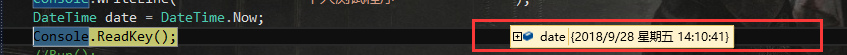
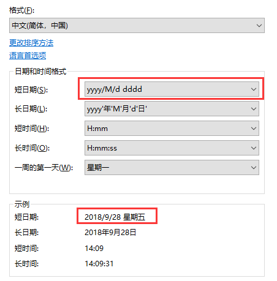
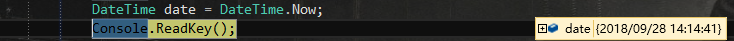
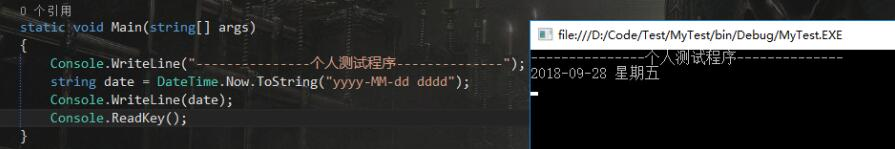

win10 DateTime 日期格式化时出现星期

写代码的时候偶然发现 DateTime 里出现了星期几，当时一阵凌乱，去网上百度没有详细解决办法，很多人说可以用用 ToString 解决。

也有部分人说可以修改系统时间的显示，我打算试一下看看行不行。

DateTime 的时间上带有星期，我去系统时间里发现。

把短日期修改后

再看代码，星期就不见了。

补充：

根据这个我又想到以前我还很费劲的转中文星期，这样一来就很简单了。

